# Simulador de Tabela de Memória  
Este repositório contém o código relativo ao trabalho prático do curso de Sistemas Operacionais ofertado pelo Departamento de Ciência da Computação. O trabalho consiste na implementação de uma memória virtual simulada, assim como alguns algoritmos de substituição de páginas nessa memória. A proposta do trabalho é descrita na próxima seção. Em seguida, apresentamos as decisões que tomamos durante a implementação para resolver o problema proposto. Por fim, apresentamos e destacamos as estruturas importantes da implementação do código, assim como fazemos uma análise de cada um dos algoritmos implementados.  

# O Problema  
O problema envolve a implementação de uma memória virtual, na forma de uma tabela de quadros de memória, a qual armazena um número limitado de endereços (páginas). Isso visa simular uma funcionalidade comum de sistemas operacionais, que é armazenar endereços nessa tabela de páginas de forma que não é necessário o acesso direto ao disco toda vez que um programa deseje ler ou escrever alguma informação, visto que esse acesso é bastante custoso.

Além das estruturas da tabela de páginas e da página em si, é também necessária a implementação de maneiras de gerir essa memória virtual, mais especificamente dos algoritmos de substituição de páginas. Esses algoritmos definem, a partir de diferentes critérios, qual página deve ser removida da memória para a entrada de uma nova página (caso a memória virtual esteja cheia).

Na entrada do problema, são especificados:

- Qual algoritmo de substituição de páginas será utilizado (FIFO, LRU, 2a ou Random);
- Arquivo .log que contém a sequência de endereços de memória acessados;
- O tamanho de cada uma das páginas (de 2KB a 64KB);
- O tamanho total da memória física disponível (de 128KB a 16384KB);

# Implementação  
A fim de implementar a memória virtual e as páginas, definimos as seguintes estruturas:
- Uma **Página** contém as seguintes informações:
  - Endereço (`address`): responsável por armazenar o endereço físico da página. Esse endereço é utilizado para verificar se a página já se encontra na tabela de páginas;
  - Bit de referência (`nxtVictim`): esse campo pode ter valor 0 ou 1, e indica se a página em questão for referenciada (tanto em escrita quanto em leitura) mais de uma vez. É utilizado pelo algoritmo de substituição 2a;
  - Tempo desde último acesso (`timeSinceAcc`): armazena em qual momento da execução do programa aquela página foi referenciada pela última vez (escrita ou leitura). É utilizado pelo algoritmo de substituição LRU;
  - Bit de página suja (`isDirty`): esse bit indica se a página está "suja", ou seja, se o conteúdo dela sofreu alguma modificação. Ou seja, sua função é indicar se, quando a página for retirada da tabela, é necessário propagar as alterações ao disco;

- A **Tabela** contém as seguintes informações:
  - Páginas (`pages`): um vetor de páginas na tabela;
  - Última página usada (`luIndex`): esse número inteiro indica em qual posição do arranjo de páginas está aquela que foi a primeira a entrar na tabela;
  - Tamanho (`size`): armazena o tamanho máximo da tabela (quantas páginas ela consegue armazenar);
  - Ocupação atual (`currOccupancy`): diferentemente do tamanho, esse campo armazena quantos espaços da tabela estão ocupados até então. Seu valor máximo é igual à quantidade de páginas que cabem na tabela;
  - Contador de tempo (`clock`): esse campo é responsável por armazenar o "tempo" atual da execução do programa. Cada operação incrementa essa variável em uma unidade. Esse valor é utilizado pelo algoritmo `lru`.
  - _Page faults_ (`pageFaults`): contador de _page faults_ que ocorreram (quando uma página não é encontrada na tabela de deve ser buscada no disco);
  - Páginas Sujas (`dirtyPages`): contador de páginas sujas que necessitaram ser propagadas para o disco;

## Detalhes de Implementação

Na função **main**, primeiramente os parâmetros fornecidos pelo usuário são armazenados em variáveis, e o tamanho total da tabela de páginas é calculado ao se dividir o tamanho total da memória física disponível pelo tamanho de uma página. 

Além disso, é calculado também quantos bits menos significativos devem ser descartados para identificar a o endereço físico da página associada a cada um dos endereços lógicos informados nas linhas do arquivo de entrada. A função para excluir os bits menos significativos foi descrita na documentação da proposta do trabalho. Entretanto, adaptamos-na para trabalhar com páginas na faixa de Kilobytes, ao invés de bytes, inicializando o valor `s` como `10`:

```c
unsigned getPageShitfBit(int p_size) {
  unsigned s;
  s = 10;
  while (p_size>1) {
    p_size = p_size>>1;
    s++;
  }
  return s;
}
```

Após essas definições, inicia-se a tabela de páginas vazia. Em seguida, o arquivo `.log` é aberto e itera-se por cada uma de suas linhas. Para cada linha, o endereço da página é calculado e a letra "W" ou "R" que é lida do arquivo define se a tabela será atualizada com base em um comando de leitura ou de escrita - essa atualização é responsabilidade da função `updateMemory`, que será descrita abaixo. 

Por fim, depois da passagem por todo o arquivo, este é fechado e mostra-se ao usuário o tempo gasto para executar o programa, assim como o **total de _page faults_ (Páginas lidas)** e o **total de _dirty pages_ (Páginas escritas)** que tiveram que ser propagadas para o disco, e o programa se encerra.

Dentro do arquivo **`table.c`**, está definida a função **`updateMemory`**, a qual é responsável pela atualização e manutenção da tabela de páginas (essa função é chamada na main em cada operação lida do arquivo de entrada). Nela, além de ser  feito o controle do tempo atual de execução (contador `clock`), é feita a inserção/substituição de páginas na tabela.

A função `alreadyExists`, invocada pela função `updateMemory`, informa se a página em questão já está na tabela, assim como qual é a posição na tabela que a nova página deve ser inserida, caso ela não esteja presente na tabela (varia de acordo com o algoritmo de substituição selecionado). A partir do retorno, existem três casos possíveis:

- A página não existe na tabela, e a tabela não está cheia:
  - Nesse caso, a página é inserida na próxima posição livre da tabela.
  - O contador de _page faults_ é acrescido de 1.
  - A ocupação atual da tabela é acrescida de 1.
- A página não existe na tabela, e a tabela está cheia
  - Nesse caso, a página que está na posição retornada pela função `alreadyExists` é substituída pela nova página. Essa página é definida a partir do algoritmo de substituição de páginas selecionado.
  - O contador de _page faults_ é acrescido de 1.
  - Se a página retirada estiver "suja" (`isDirty == true`) o contador de _dirty pages_ é acrescido de 1.
- A página já existe na tabela
  - Nesse caso, não ocorre substituição. O bit de referência (i.e., `nxtVictim`) é atualizado para 1 E, em todo caso, se for uma operação de escrita a página é definida como "suja" (`dirtyBit` é setado como 1).

# Execução

Para executar o programa, primeiramente deve-se compilá-lo com o comando `make`. Uma vez que o arquivo executável tenha sido criado, esperam-se como parâmetros os seguintes valores:  
`./tp2virtual [algoritmo] arquivo.log 4 128`  

Onde:

- `tp2virtual`: é o nome do arquivo executável que foi gerado após o `make`;
- `[algoritmo]`: especifica qual algoritmo de substituição de páginas deverá ser utilizado;
  - First In First Out: "fifo";
  - Least Recently Used: "lru";
  - Segunda Chance: "2a";
  - Random: "rand";
- `arquivo.log`: deve ser o nome do arquivo do tipo `.log` que contém a sequência de endereços de memória acessados, assim como o tipo de acesso (leitura ou escrita) de cada endereço;
- O terceiro parâmetro define o tamanho de uma página, podendo ser de 2 a 64 (deve ser potência de 2);
- O quarto parâmetro define o tamanho total da memória física disponível para o processo, podendo ser de 128 a 16384 (deve ser potência de 2);


## Análise de resultados

Nessa seção, será feita uma breve apresentação de cada um dos algoritmos de substituição empregados, assim como a análise de complexidade esperada de cada um e o resultado real obtido. Além disso, também serão feitas comparações entre os algoritmos tomando como base a variação dos números de page faults, dirty pages e tempo de execução conforme o tamanho da tabela de páginas (relação tamanho memória total / tamanho da página) também varia.

## LRU
O LRU, ou Least Recently Used, é um algoritmo de substituição que se baseia no tempo decorrido desde que cada página foi acessada. A página a ser retirada é aquela que foi acessada há mais tempo (`max(tempo atual - tempo em que a página foi acessada)`).  
Para encontrar a página que foi acessada há mais tempo, portanto, é necessário percorrer toda a tabela de páginas - isso implica que esse algoritmo tem custo **O(n)**, onde n é o número de páginas da tabela.

## FIFO
O FIFO, ou First In First Out, é um algoritmo de substituição que consiste em substituir a página que entrou primeiro na tabela (em relação às demais páginas). Na implementação que foi feita, a tabela de páginas possui um campo responsável por armazenar a posição da primeira página que foi inserida, e toda vez que essa página é retirada esse campo passa a apontar para a próxima página que possui essa propriedade. Dessa forma, o algoritmo é **O(1)**.

## Segunda Chance (2a)
O algoritmo Segunda Chance é bem similar ao FIFO, mas possui um diferencial: as páginas possuem um bit de referência. Esse bit é inicializado como 0 e, caso a página seja acessada mais de uma vez, ele se torna 1.  
O funcionamento do algoritmo é similar ao FIFO porém, caso o bit de referência da primeira página (que seria a substituída no FIFO) seja igual a 1, aquela página não é substituída, seu bit de referência é definido como 0 e o algoritmo passa para a próxima página (que, no caso, seria a segunda página a ter sido inserida). Essa iteração continua pela tabela de páginas até que uma página com bit de referência igual a 0 seja encontrada e, então, substituída.
Devido ao fato de ser necessário iterar pela tabela de páginas para encontrar uma página válida, esse algoritmo é **O(n)** no pior caso, onde n é o tamanho da tabela.

## Random
O algoritmo Random, assim como o FIFO e o Segunda Chance, se baseia no campo da tabela de páginas que aponta para a primeira página a ter sido inserida na tabela. Todavia, o algoritmo gera um número inteiro aleatório entre 0 e 2, o qual é somado ao valor do campo da tabela. Dessa forma, Random seleciona aleatóriamente uma das três primeiras páginas que foram inseridas para ser substituída. Como a obtenção dessa página é "direta", esse algoritmo também é **O(1)**.

## Comparação entre algoritmos

Ao comparar valores reais durante a execução, os algoritmos implementados são bastante similares. Abaixo provemos gráficos comparativos entre os algoritmos por tempo de execução, _page faults_ e _dirty pages_.

### Comparação dos algoritmos por tempo de execução

Em relação ao tempo de execução, podemos notar que embora a complexidade assintótica dos algoritmos seja diferente para o pior caso, para o caso médio elas são similares (assemelhando-se a uma curva logarítmica). Vale ressaltar que, em nossa implementação, antes de executar os algoritmos de substituição de páginas, a tabela de páginas é varrida do início ao fim, para verificar se a página já se encontra na tabela. Portanto, a _baseline_ do algoritmo completo é **O(n)**, onde n é o número de páginas na tabela. A este limite inferior soma-se a complexidade de cada algoritmo de substituição de páginas.

<div>
    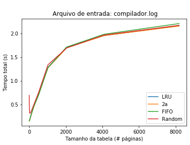 </img>
    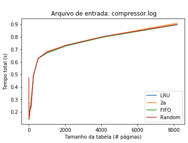 </img>
    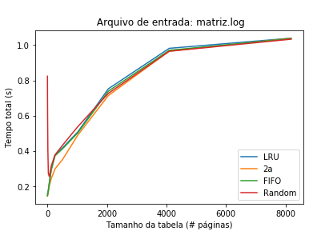 </img>
    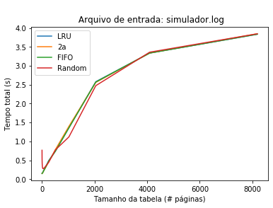 </img>
</div>

### Comparação dos algoritmos por _page faults_

A curva de _page faults_ por tamanho da tabela se comporta como esperado: ao aumentar o número de páginas na tabela, diminuímos o número de _page faults_. Chamamos atenção para o arquivo `compressor.log` que, em particular, possui um número significativamente baixo de _page faults_ para qualquer valor de tamanho de tabela, possivelmente por acessar sequencialmente endereços próximos com alta frequência.

<div>
    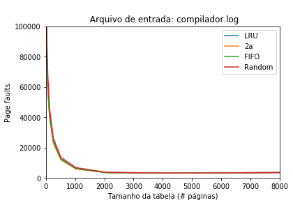 </img>
    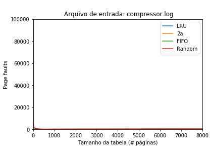 </img>
    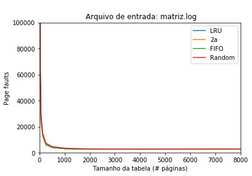 </img>
    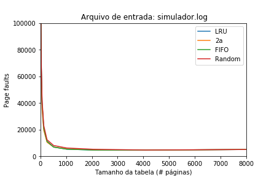 </img>
</div>

### Comparação dos algoritmos por _dirty pages_

Assim como na análise de _page faults_, os gráficos de _dirty pages_ se comportam como esperado: quanto maior o número de páginas na tabela de páginas, menos páginas "sujas" precisam ser re-armazenadas em disco, após serem modificadas. Também no caso de _dirty pages_, o arquivo `compressor.log` se destaca por possuir um número baixo de páginas "sujas" para quaisquer valores de tamanho de tabela.

<div>
    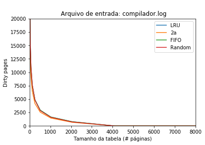 </img>
    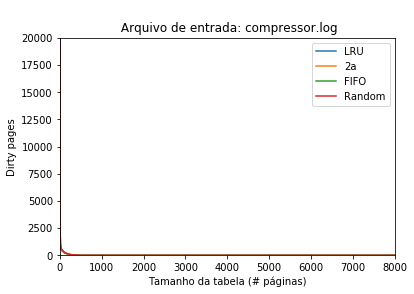 </img>
    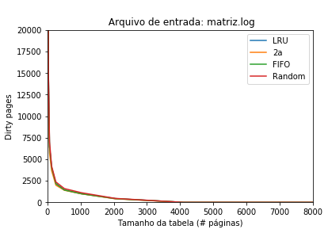 </img>
    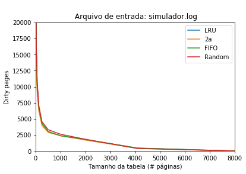 </img>
</div>  
  
  
Autores:  
- @[lucasclopesr](https://github.com/lucasclopesr)  
- @[franciscobonand](https://github.com/franciscobonand)
